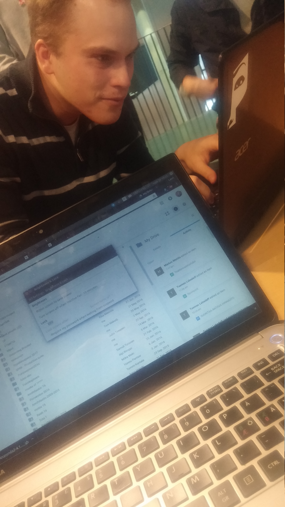

First Group Meeting
===================

:date: 2016-09-28
:category: Group Meeting
:tags: Week 1-2
:slug:
:authors: Jaan Tollander de Balsch
:summary: Group Meeting

We met at the CS building to discuss the first steps of our project. After an intensive photoshoot to capture our freely flowing creative process, we soon arrived at a satisfactory title for our party: 4+3Dudes. After some brief discussion about blog-keeping tools, we began talking about the scope of our project.

Despite our previous research finding that LIDAR is a superior tool compared to our SfM tools, one of our group with experience in a company working with SfM technique protested: the company was of the opinion that SfM offers a sufficient degree of detail while being a lot faster and cheaper.

We discussed ideas on what to present to the instructor of our project and came up with several. The main division was between modelling structures and objects. The modelling of structures offers multiple approaches within the field as well: mainly whether to model the exteriors or interiors of buildings. Exterior modelling could be used as a tool for architectural studios when planning a new building (to get information about the shape of the terrain) or even as a way to preserve UNESCO heritage sites virtually.

Interior modelling was in our opinion perhaps slightly more promising. Textured interior 3D models could be used to do appartement showings online: the model would allow for unrestricted movement in the space unlike traditional 2D images. Personal location indoors where GPS may not necessarily work is also an unsolved problem: 3D models have been shown to be able to place a camera in an existing 3D model with great accuracy. The technique could also be used alongside augmented reality to guide the user through the interior of a building. AR combined applications include also virtual furniture catalogs with which the user place models of furniture to the space where he or she is and try out different options without the risk of buying a piece of a wrong size etc.

Using SfM on objects was also discussed, but we didn’t find many selling points for the technique besides taking your everyday objects into virtual reality with you, the demand for which is probably quite meagre.
