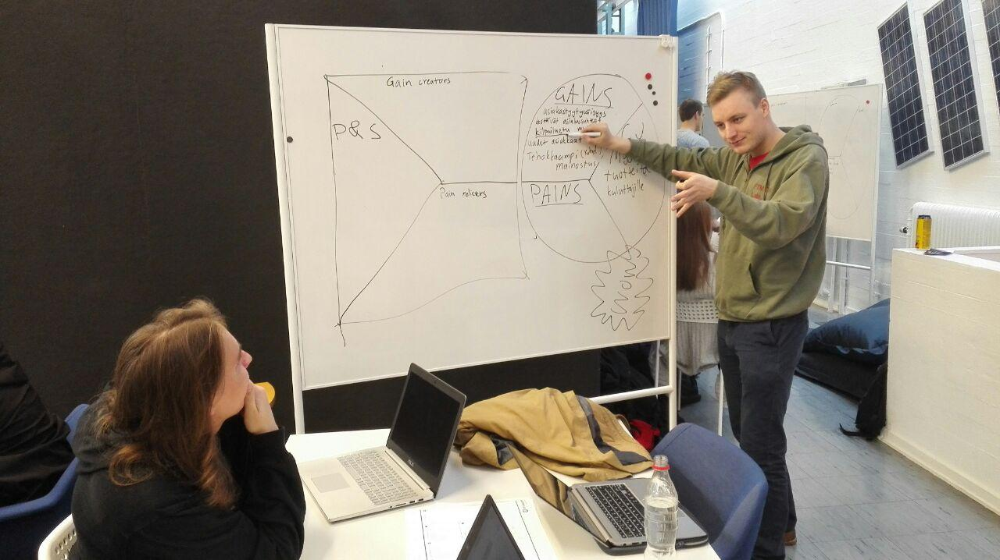
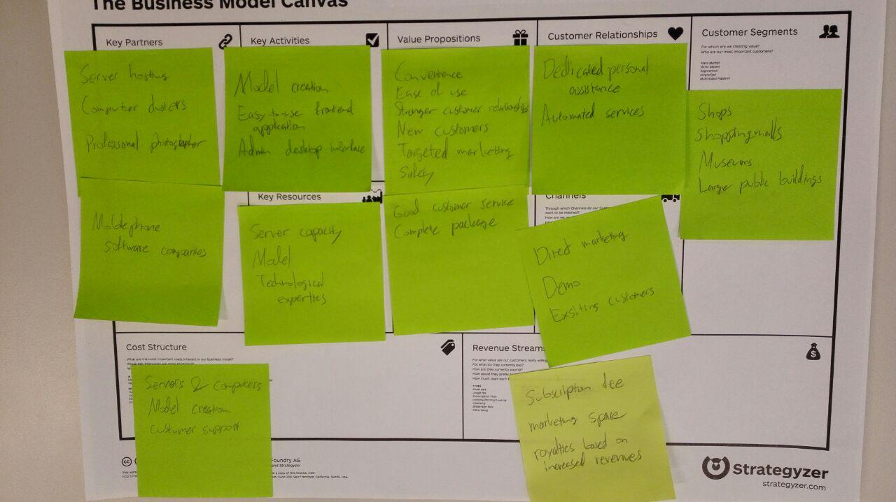

Project Plan
============

:date: 2016-10-14
:slug: project-plan
:tags: Week 2, project plan
:authors: Jaan Tollander de Balsch; Aapo Haavisto; Antti Karkinen; Misamatti Koistinen; Lauri Seppäläinen; Juhani Sipilä; Markus Tyrkkö,

Introduction
------------
For outdoor use GPS (Global Positioning System) developed by USA has established itself as a standard for locating objects and people. Unfortunately indoors GPS does not often work and the accuracy is not enough for many applications. There are many alternative methods for indoor navigation that are based on different technologies such as Wi-Fi station triangulation or fingerprint locating or observing Earth's magnetic field. However, the lack of unified wireless infrastructure and standardisation interferes suitability of these technologies.

Rapidly developing computing power of handheld devices enables new kinds of sophisticated solutions to locate users indoors. Technique called *Structure from Motion (SFM)* makes it possible to form 3D model based on photographs or video images taken from several different locations and directions. Profiling points are identified from the photographs and 3D point cloud can be formed. This is used to construct the 3-dimensional model. When we later take photographs of the space, the location of the camera is possible to identify with significant accuracy from generated 3D model.

Clear strength compared when SFM technology to other indoor positioning methods is that it works reliably, for example, using a standard smartphone camera. Both the formation of the model and utilization are possible with existing and affordable devices. Also, there is no need  for separately installing expensive infrastructure in the space where indoor navigation is used.

The purpose of this project is to find out

- Is photograph based positioning indoor positioning system a viable option?
- Can this technology achieve adequate accuracy with available consumer devices such as smartphone cameras?
- Who would be willing to pay for such a service, and what kind of synergies it would have, for example, with advertising, or in a context of mobile games?
- We are also investigating wheter a small-scale prototype is realistic in the conclusion of the project.

Potential Customers and End users
---------------------------------
We try to direct the main focus of the project for solving a mundane and practical problems related to indoor positioning. Then end-users would likely be ordinary consumers. Indoor positioning with technique described above is possible to implement with many devices available to consumers so we can see the most potential in a commercial consumer products.

One of the main customer groups are shopping centers and major hypermarket-class shops, which could take advantage of indoor positioning to provide a better customer experience, guidance service and presentation of advertisements. In addition to shops other large public places, such as museums might be interested in the possibilities for increasing the AR-elements to improve the customer experience. Elements in augmented reality could be signs, but also various commercials and reconstructions to provide customers with much wider than usual museum experience.

In addition to customers that utilize alternate reality it could also be used to create high-speed 3D-models of limited size interior of buildings, for example, the virtual presentation of apartments. In this case, the advantage would be particularly affordability and ease of use, because the modeling is based entirely on the existing technology.

Scope of the project
--------------------

We will make a brief statement of interest of retail stores in new positioning methods, as well as interview customers to find out problems they have encountered and potential solutions more efficient positioning solutions can bring to them. Based on the analysis we seek to create a demo based on SFM technology and present a business model.

.. csv-table::
   :file: tables/time-usage.csv

Schedule and Milestones
------------------------
The project schedule is set to according scheduling based on the course. We have set a deadlines for the various sub-regions as follows

.. csv-table:: Schedule
   :file: tables/schedule.csv
   :widths: 20, 80

Schedule is monitored weekly meetings, which dates agreed Thursday at 10.00

Data Collecting
---------------
The collection of data is divided into two main phases: the formation of the theoretical basis based on the articles and fieldwork in the form of interviews. In the first phase, the objective is to provide a comprehensive overview of the current state of technology, the opportunities and challenges as well as create a realistic idea of the level of complexity for the produced demo. Articles form the basis of the concepts of the interviews. The interviews will be carried out either by phone or physically on site and, depending on the location of the interviewee's schedule. The purpose of the interviews is to identify the potential customer interest in the concept and at the same time to get a new perspective for the development of the concept. The final concept and demo is created on the basis of issues and areas of development raised in the interviews .

Risks
-----
We have mapped the risks related to the project and to prepare for them as follows

.. csv-table::
   :file: tables/risks.csv
   :widths: 40, 20, 40

Responsibilities
----------------
Our group consists of seven people, whom we have shared responsibilities roughly as follows. The division of responsibility is indicative only, and not on the basis not intended to form a significantly differing roles within the group. The idea is that each take on the role of a little more of said sub-region while the other in the best possible way of subsidies.

.. csv-table::
   :file: tables/responsibilities.csv
   :widths: 30, 70
