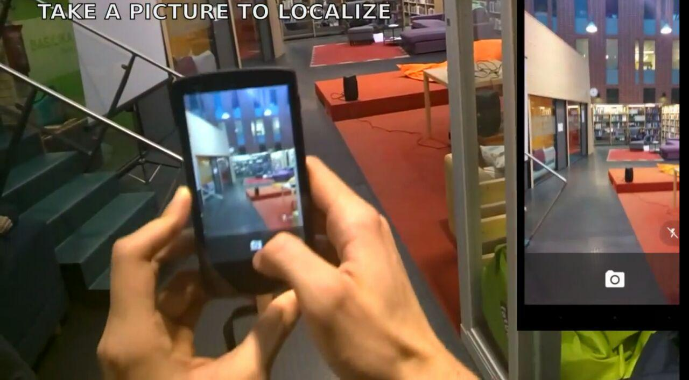

Notes on SFM and Image Based Navigation Research
================================================

:date: 2016-10-23
:slug: research
:tags:
:authors: Jaan Tollander de Balsch; Aapo Haavisto; Antti Karkinen; Misamatti Koistinen; Lauri Seppäläinen; Juhani Sipilä; Markus Tyrkkö,

During our weekly meeting we decided to do some research on some already existing technologies (and those under constant development) for indoor localization, focusing on the work done by our supervising professor Antti Ylä-Jääski and his research group. With their iMoon system they have provably (`youtube`_) succeeded in pinpointing indoor locations with sufficient accuracy using user-provided photos. Our team studied the technologies behind iMoon by reading an article published by Ylä-Jääski and his colleagues [iMoon]_.

.. _youtube: https://www.youtube.com/watch?v=sNvf7N_s59c&feature=youtu.be

Indoor navigation is a topic that has been researched for several decades. Yet there isn’t a solution that could be widely utilized in every environment, for floor plans of public buildings are either not detailed enough or are not kept up to date. Many other methods also need a specific and often expensive infrastructure to be installed in the location. Thus an alternate method is direly needed. The method should be able to adapt to constantly changing environments and be efficient at the same time. Ylä-Jääski’s research group is developing a method to achieve the aforementioned requirements.

iMoon technology is based on generating 3D-models from multiple pictures taken from a space and then matching new pictures with the model to determine a location. The model is generated using Structure from Motion technology which provides a point cloud of the environment. The photos can be crowdsourced and taken with differing equipment. While users take new photos to determine their location, these photos are also used to update the model.

Because of varying quality and locations of crowdsourced photos, it’s unlikely that every corner of the area is covered in many good quality photos. This being the case, iMoon first creates new separate model from new images and then tries to merge separate model with existing one by comparing details in both models. This way the model can also adapt to small changes in environment caused by eg. moving furniture and other objects.

iMoon also utilizes other technologies in addition to locating the user with pictures. This is necessary to keep the computation time at minimum and to provide a pleasant user experience. The time complexity of calculations increase with respect to the size of the model for more points need to compared with one another. In order to narrow down the raw location of the user iMoon uses Wi-Fi fingerprinting with K-nearest neighbours algorithm.

In addition to Wi-fi fingerprinting, iMoon also utilizes user provided trajectories to generate original model and later increase navigation accuracy. Using information from motion sensors available in various smartphones, iMoon can calculate distance user has walked from last known location. The research group found out that the use of trajectories significantly improves performance of the service and quality of the generated model.

iMoon is also capable of calculating navigation instructions and presenting them on top of existing images, which can be seen on youtube video linked earlier. Embedded navigation have positive impact on user friendliness, but they also provide base for using application with smart glasses like Google Glasses.

The most relevant advantage of iMoon is that it runs on regular smartphones. This makes the technology affordable and user friendly. When compared to pure Wi-Fi positioning and image based positioning without Wi-Fi fingerprinting or user trajectories, iMoon clearly outperformed Wi-Fi positioning in every aspect, but was not significantly more accurate than pure image-based positioning. Both of them were able to locate user from :math:`95` percent of the photos sent with :math:`2` meters of location error and :math:`6` degrees of facing direction error. The main question here is about performance, and that’s where iMoon is superior when compared to pure image-based positioning. On average, iMoon was able to locate user in under :math:`4` seconds but reference implementation took over :math:`40` seconds, which is far from acceptable when considering actually usable system that someone would actually pay something.

There are also many other technologies to use for indoor positioning, like Bluetooth beacons and analyzing magnetic field. We’ll do a bit more research before presenting those in detail, but we’ll get back to them in the next post.

References
----------

.. [iMoon] Dong, J., Xiao, Y., Noreikis, M., Ou, Z., & Ylä-Jääski, A. (2015). iMoon : Using Smartphones for Image-based Indoor Navigation Categories and Subject Descriptors. Proceedings of the ACM Conference on Embedded Networked Sensor Systems, 85–97. http://doi.org/10.1145/2809695.2809722
