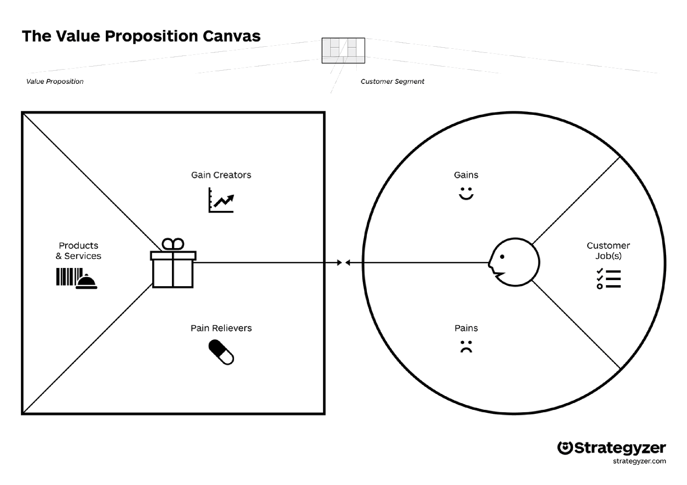

Value Proposition
=================

:date: 2016-11-04
:slug: Value Proposition
:tags:
:authors: Jaan Tollander de Balsch; Aapo Haavisto; Antti Karkinen; Misamatti Koistinen; Lauri Seppäläinen; Juhani Sipilä; Markus Tyrkkö,

Market Owners
-------------

Customer Segment
^^^^^^^^^^^^^^^^
Customer Job

* Buying food, groceries or other products

Pains

* Getting lost in large hyper markets and not finding needed products
* Wide variety of products can make finding special product harder
* The needed product being sold out

Gains

* Finding needed products with less effort and faster
* Benefiting from the best discount offers finding about best deals

Value Proposition
^^^^^^^^^^^^^^^^^
Products and Services

* Real time indoor navigation
* Guiding customer to the destination and aiding in finding special products
* Possibility of adding AR guides or advertisement

Pain Relievers

* AR guides help finding products faster

Gain Creators

* People will find the products they were looking leading to increased sales
* Better customer experience

Marker Customers
----------------

Customer segment
^^^^^^^^^^^^^^^^
Customer jobs

* Filling the fridge
* Buying groceries and other needed products

Pains

* Being lost in a strange hypermarket and not finding needed products
* Wide variety of products so customer needs to put extra effort on finding the right one
* The needed product being sold out

Gains

* Benefiting from the best discount offers
* Finding needed product without further effort

Value proposition
^^^^^^^^^^^^^^^^^
Products and services

* Real-time indoor positioning and navigation with embedded augmented reality information about products

Pain relievers

* Offering replacing products when the one needed is sold out
* Navigation instructions directly to the needed product

Gain creators

* Real-time navigation
* Easily accessible information about different products and discount campaigns

Museums
-------

Customer segment
^^^^^^^^^^^^^^^^
Customer jobs

* Offering interesting exhibitions that attract people
* Teaching new things to visitors

Pains

* Not enough visitors to keep museum running
* People finding museums boring or old-fashioned in general
* Expensive investments

Gains

* Customer satisfaction
* Interesting and modern brand

Value proposition
^^^^^^^^^^^^^^^^^
Products and services

* Real-time indoor positioning and navigation with embedded augmented reality information about objects on exhibition

Pain relievers

* Not requiring any additional infrastructure to be installed
* Keeping up with time by digitizing services

Gain creators

* Real-time navigation
* Easily accessible, interesting information about objects
* Interesting digital service, which is easy and fun to use
