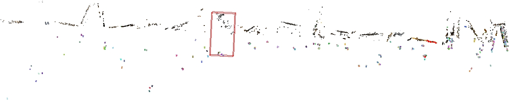
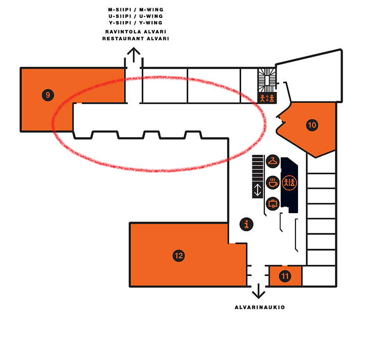
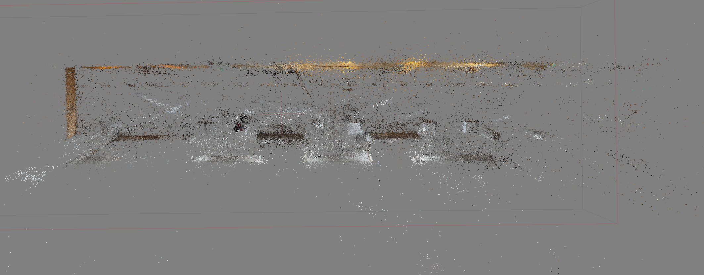
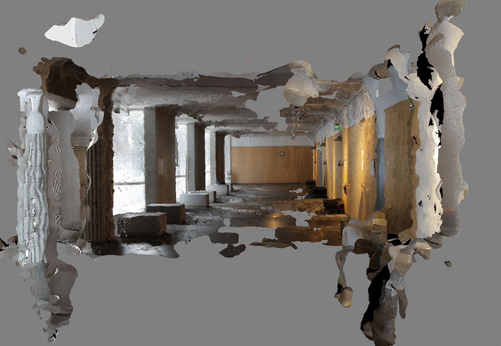

Creating the Prototype
=======================

:date: 2016-11-11
:slug: prototype
:tags: prototype
:authors: Jaan Tollander de Balsch; Aapo Haavisto; Antti Karkinen; Misamatti Koistinen; Lauri Seppäläinen; Juhani Sipilä; Markus Tyrkkö,

Creating 3D models with VisualSFM
---------------------------------
Creating a 3D model from images with VisualSFM consists of three steps. [VisualSFM]_

1. Feature Detection & (Full) Pairwise Image Matching
^^^^^^^^^^^^^^^^^^^^^^^^^^^^^^^^^^^^^^^^^^^^^^^^^^^^^

.. figure:: images/vsfm/match.PNG
   :alt: match
   :width: 100%

Feature detection of the images finds similar features from each image in order to perform the pairwise image mathing. This operation determines where images are positioned in respect to one another

Full pairwise image matching compares every image with every other image in order to do the matching. Full pairwise matching is the only way if we have completely random images but it is computationally expensive.

2. Sparse Reconstruction
^^^^^^^^^^^^^^^^^^^^^^^^

.. figure:: images/vsfm/sparse_cloud.PNG
   :alt: sparse cloud
   :width: 100%

Sparse reconstruction constructs the point cloud from the matched images. It finds the spatial positions the images in the 3D space. Point cloud is required for indoor navigation.

3. Dense Reconstruction
^^^^^^^^^^^^^^^^^^^^^^^

.. figure:: images/vsfm/giphy.gif
   :alt: dense reconstruction
   :width: 100%
   :target: https://jaantollander.github.io/3D-models/kaivuri/examples/kaivuri.html

Dense reconstruction builds the full 3D model with textures from the sparse reconstruction. This is optional step for the indoor navigation but required for additional features that require 3D model such as *alternate reality (AR)*.

Live 3D model can be accessed by clicking the gif image above or `this link`_. It is displayed and rendered with Potree. [Potree]_

.. _this link: https://jaantollander.github.io/3D-models/kaivuri/examples/kaivuri.html

----

3D Model of Learning Center Beta
--------------------------------

We took approximately 300 photos from the ground floor of the Learning Center beta and computed point cloud using VisualSFM. The results didn't quite turn out as expected.

VisualSFM generated 23 separate models from the photos. VisualSFM had trouble connecting photos shot with different cameras to each other and the relatively low number of photos considering the size of the space made it hard to combine them into a single model. VisualSFM is known to create many models even with ample amounts of photos due to the way that it builds the point cloud. One possible solution is to add more photos, but that would make the several hour computing time even longer.

Most of the cameras were placed in the red circle. This is the most simple part of the floor. It's a large open space so it's easy to take enough overlapping photos. Closer to the entrance the space is divided into much smaller sections which makes it hard to capture photos with enough features for the algorithm to work properly.

By changing the feature detection algorithm to search for more details and using a proprietary software for the point could reconstruction we were able to get a bit better results. The program was able to place around twice as many cameras and find more points. 

The results are only a slight improvement compared to the VisualSFM and generating a complete model of the whole floor would require many more photos. We estimate that a accurate model for indoor positioning purposes would require around 1000-2000 photos. Shooting a couple thousand photos is not a problem but with that many pictures feature recognition and matching becomes a problem. Without any additional knowledge of the photos every photo has to be matched with every other photo to find possible connections. This means that the computing time grows quadratically as the number of photos increases. With a powerful home computer processing a few thousand photos would take several days. We have to investigate ways to optimize our feature matching or find a powerful computing cluster.

----

References
----------
.. [VisualSFM] Wu, Changchang. "VisualSFM: A visual structure from motion system." (2011).
.. [Potree] Potree | WebGL pointcloud renderer http://www.potree.org/
