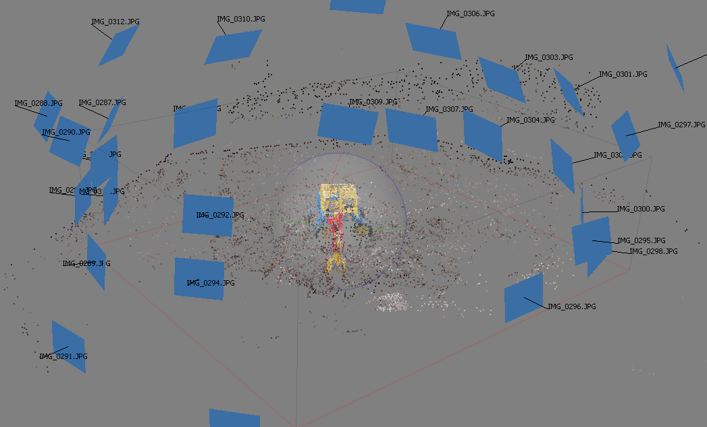

Prototype
=========

:date: 2016-11-11
:slug: prototype
:tags:
:authors: Jaan Tollander de Balsch; Aapo Haavisto; Antti Karkinen; Misamatti Koistinen; Lauri Seppäläinen; Juhani Sipilä; Markus Tyrkkö,

.. :status: draft

3D Modelling with VisualSFM
---------------------------
3D modelling with VisualSFM consists of three steps. [VisualSFM]_

- Feature Detection & Pairwise Image Matching
- Sparse Reconstruction (required for indoor navigation)
- Dense Reconstruction (required for additional features such as AR)

Feature Detection & (Full) Pairwise Image Matching
^^^^^^^^^^^^^^^^^^^^^^^^^^^^^^^^^^^^^^^^^^^^^^^^^^

.. figure:: images/vsfm/match.PNG
   :alt: match

Feature detection of the images finds similar features from each image in order to perform the pairwise image mathing. This operation determines where images are positioned in respect to one another

Full pairwise image matching compares every image with every other image in order to do the matching. Full pairwise matching is the only way if we have completely random images but it is computationally expensive.

Sparse Reconstruction
^^^^^^^^^^^^^^^^^^^^^

Sparse reconstruction constructs the point cloud from the image matches. It finds the spatial positions the images in the 3D space. Point cloud is required for indoor navigation.

Dense Reconstruction
^^^^^^^^^^^^^^^^^^^^

.. figure:: images/vsfm/giphy.gif
   :alt: dense reconstruction

Dense reconstruction builds the full 3D model with textures from the sparse reconstruction. This is optional step for the indoor navigation but required for additional features that require 3D model such as AR.

3D Model of the Main Building Lobby
-----------------------------------

References
----------
.. [VisualSFM] Wu, Changchang. "VisualSFM: A visual structure from motion system." (2011).
