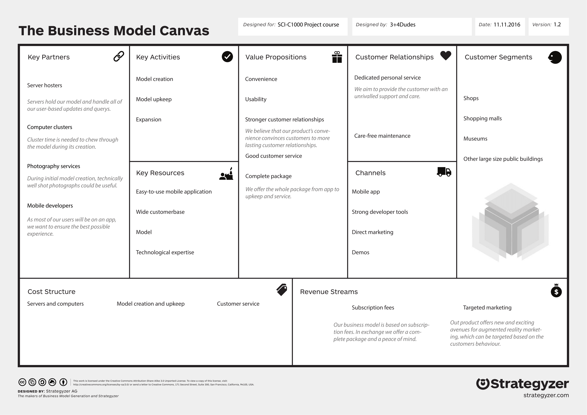
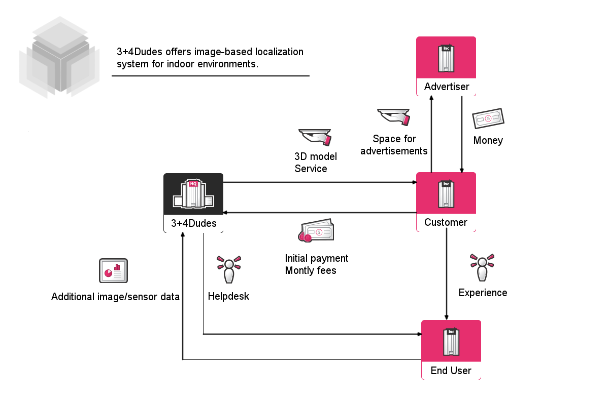

Refining the business model
============================

:date: 2016-11-18
:slug: bmc
:tags: bmc
:authors: Jaan Tollander de Balsch; Aapo Haavisto; Antti Karkinen; Misamatti Koistinen; Lauri Seppäläinen; Juhani Sipilä; Markus Tyrkkö,

This week the topic our of weekly meeting was refining the business model canvas and the monetization model.

Business model canvas
---------------------------------

Monetization model
------------------------

The monetization model consists of initial fixed cost and monthly maintenance and update fees. The initial cost varies case-by-case depending on the contract made with the customer. Facts taken into consideration when making the contract are the size and complexity of the area to be modelled.  To model larger area more photos are needed and constructing model from a large set of photos takes significant amounts of time and processing power. The size of the monthly costs are based on estimated amount of end users and the additional customer specific features. Computing the position and orientation of the users’ camera is computationally intensive task and therefore requires large investments in server architecture.

We also considered other monetization models, but the SaaS (Software as a Service) approach was the most effective one. The single payment model was rejected because upkeep of the positioning servers is expensive and the customer is not willing to invest in server hardware. Also the possibility to take provision of the increased sales generated by the state-of-the-art advertising, but the idea was rejected because it is impossible to accurately measure the increased revenue caused by the advertising.
