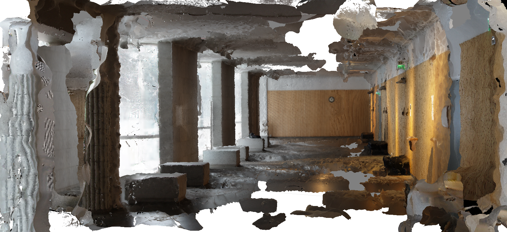

Invitation to Grand Finale at 2016-12-09
========================================

:date: 2016-11-24
:slug: grand-finale-invitation
:tags: grand finale invitation
:authors: Jaan Tollander de Balsch; Aapo Haavisto; Antti Karkinen; Misamatti Koistinen; Lauri Seppäläinen; Juhani Sipilä; Markus Tyrkkö,

   *Click the image for 3D model*

Our team warmly welcomes you to hear our presentation and further investigate our results about *indoor navigation using point cloud from photos*  on **december 9th**. Presentations are held at Aalto University main building lobby in **Otakaari 1**.

During this fall our project group has been researching a new innovative method for indoor navigation using *structure from motion* and crowd sourced photos. We have estimated its potential and possibilities.

This kind of navigation is made possible with *structure from motion* technology which makes generating 3D models from multiple ordinary photos possible. Generated point cloud can be used for indoor navigation and dense reconstruction (3D model with texture) offers the possibility of using augmented reality elements.

You can read more about our research from the blog and these posts

- `Comparison Between Indoor Navigation Systems <{filename}./2016-10-28-comparison.rst>`_
- `Creating the Prototype <{filename}./2016-11-11-prototype.rst>`_
