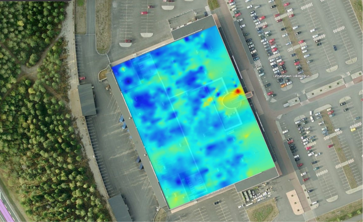
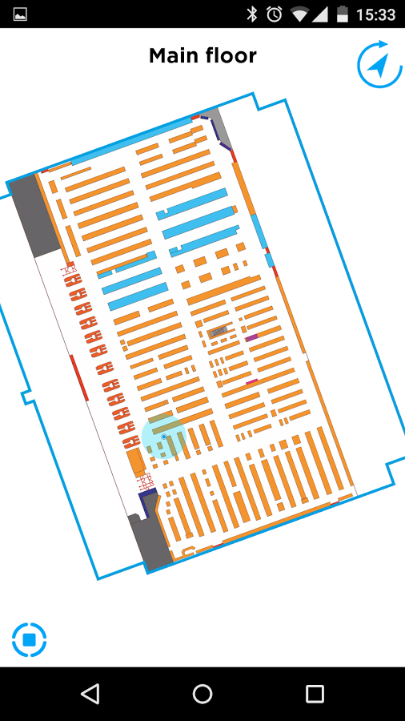

Further Research on Indoor Positioning
======================================

:date: 2016-12-01
:slug: further-research
:modified: 2016-12-02 11:57
:tags: pedestrian dead reckoning, bluetooth triangulation, geomagnetic positioning, 3D-modelling, Indoor Atlas, Wi-Fi triangulation
:authors: Jaan Tollander de Balsch; Aapo Haavisto; Antti Karkinen; Misamatti Koistinen; Lauri Seppäläinen; Juhani Sipilä; Markus Tyrkkö,

   *Picture of unique map used in geomagnetic positioning*

In a `blog post <{filename}/2016-10-28-comparison.rst>`_ written a few weeks ago we looked at competing techniques in the field of indoor positioning. In this post we will follow up on the analysis and present how our technology compares.

Recap on Comparison Results
---------------------------
Compared to *pedestrian dead reckoning* we are simply far more accurate, and our error is not cumulative. Our limitation - the need to be connected to internet - is hardly a problem in our modern age. Compared to *bluetooth triangulation* we have the strength of not needing any infrastructure. In fact, we consider this one our main benefits, but we are not uncontested in this category.

Our key selling point is the freedom from infrastructure, but we are not alone in this category. Both *Wi-Fi triangulation* and *geomagnetic positioning* offer the same benefit in most spaces nowadays as Wi-Fi is near ubiquitous. They are both rather accurate and geomagnetic positioning has a “cool” factor with it, something that we thought was singular for our *3D-modelling*. This forced us to rethink our technology’s strengths: we are not the only ones with these benefits.

   *Indoor Atlas MapCreator*

Contacting Indoor Atlas
-----------------------
We contacted the people at `Indoor Atlas <http://www.indooratlas.com/>`_, company that produces geomagnetic indoor positioning technology, to find out what they consider their main selling points to help rediscover our own. When it comes to selling their technology they point out that it is very good at selling itself. It is also **highly scalable**, **quite accurate** and has **very low maintenance costs**. These are all shared traits with our technology. The same points can be extended to Wi-Fi triangulation as an existing Wi-Fi infrastructure works in most spaces anyway, and if the connection works, so will positioning based on it. Of course, our technology and geomagnetic mapping can be extended to spaces where Wi-Fi is not present, giving these two approaches a slight edge over Wi-Fi.

Conclusions
-----------
This is where we realized that we have very little unique to offer compared to other technologies. Geomagnetic positioning and to an extent Wi-Fi positioning has every property we thought would be our trump card. We had to take another look into our situation: we operate in the same field with similar technologies, but there are some thing that can us the edge over others. One of them is our innate ability to create 3D-models, which can then be used in AR applications.

This also made us realize that we are a few years ahead of our time, as not all smartphones are capable of on-the-fly 3D-rendering while essentially recording video and overlaying them two. Still, our project can show that 3D-models can be created and maintained easily from pictures alone and with sufficient hardware, these models could be used to create AR applications that work in tandem with indoor positioning.

If our list of unique technological benefits is this slim, we have to look for strengths elsewhere. This made us to look further into how our business model could be more competitive. As a solution we thought to heavily invest into the ease-of-use of our mapping system for our partners (retail, museums etc.). Our solution of indoor positioning should be a complete package, a hassle-free system that is entirely installed and maintained by us. We should offer dedicated and personalised customer support, able to accurately answer to and solve customer fast. A good customer service renders us a more desirable solution for our partners.
