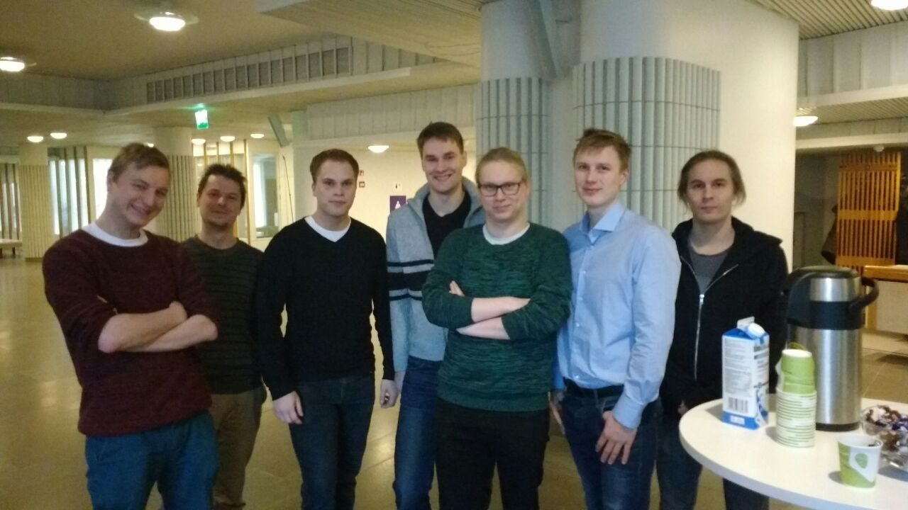

Analysis of the Teamwork
========================

:date: 2016-12-08
:slug: teamwork-analysis
:tags: teamwork analysis
:authors: Jaan Tollander de Balsch; Aapo Haavisto; Antti Karkinen; Misamatti Koistinen; Lauri Seppäläinen; Juhani Sipilä; Markus Tyrkkö,

   *Team 3+4Dudes*

.. On our team dynamics

This week’s group meeting was dedicated to two things: practicalities concerning tomorrow’s Grande Finale, and discussing our group dynamics and how we felt that our group has grown during these months.

First, however, a word about our group meetings that we have neglected to describe thus far. Our group meetings consist of catch-up across different people about the state of their respective tasks and dealing out new ones. A few things we have learned to be invaluable to do in addition to these somewhat simple topics are re-evaluation and visual thinking. At a few points along the course we have gathered to discuss our project as a whole and to ponder whether we are going in the right direction. Taking a step back has often shown to be an eye-opening experience. Another lesson learned is the value of visual thinking: the simple act of writing our ideas down and drawing diagrams. We have noticed how these small visualisations help us to shape and focus our process.

Anyway, time to move the spotlight back at us. As we set out to this rather grand project, our team work was not very organized. We spent the first few weeks in an anarchistic dream: no leadership, only ideas. Suffice to say, this lead to slow progress. Under pressure our figurative lump of coal began its metamorphosis. **Misamatti** was selected as our team leader and as our first Amendment he started our Thursday morning meetings, the structure of which is described in the above paragraph. With his help the natural process of job division took its course and we emerged out. He has led us with a supportive and subtle style, which is exactly what a motivated group needs in our opinion. **Misamatti** also was from the start the one to research the strengths and boundaries of our idea. Another great mover and shaker of this project has been **Markus**, who has at many junctions been the one pushing us forward. He has been the one behind our sleek presentations and has helped tremendously in the organization of our group. Our technical team consists of **Aapo**, **Jaan**, and **Juhani**, who all we have thank for our impressive 3D-demos. **Jaan** has also worked as the tech guy behind this blog. **Aapo** has always been thinking about the business possibilities of our product while also participating in the technical side. He has also introduced us to many problem solving and innovating processes. **Juhani** has from the start been researching the technical aspects and realisation of our model, and he also participated to business interviews when we were mapping out our marketing landscape. **Antti** has helped us to generally plan our technical side and he was responsible for our business interviews, writing our questions and coordinating our efforts in that front. I myself, **Lauri**, have been researching competing technologies, contacting them and have also written quite a few of our blog posts.

As a group we have grown from our rather rough beginnings. After the emergence of leadership we have quite naturally slipped into our respective roles. The technical guys began cracking the problem of modelling while the rest of us set our sights towards the current market. While we were working on our respective fields, we have increasingly been noticing the value of cross-team sharing - often an outside look has proved to be the critical rung in our figurative ladder in our ascent. All in all, our team has advanced significantly during this process and we now function in a manner totally unlike than our initial setting out.