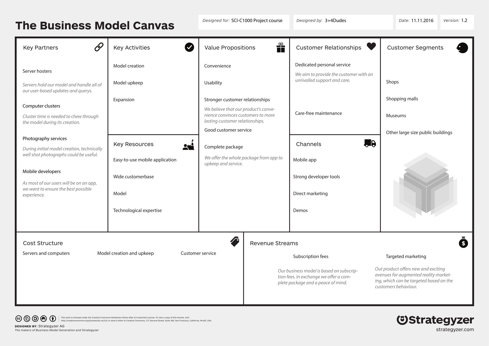

Clarification to Business Model
===============================

:date: 2016-12-11
:slug: clarification-to-business-model
:tags: business model, monetization model, key partners, key activities, key resources, value proposition, channels, customer segments, cost structure, reveneus streams
:authors: Jaan Tollander de Balsch; Aapo Haavisto; Antti Karkinen; Misamatti Koistinen; Lauri Seppäläinen; Juhani Sipilä; Markus Tyrkkö,

Since our post about `business bodel canvas and monetization model <{filename}/2016-11-17-refining-the-business-model.rst>`_ left some questions unanswered, we decided to clarify aspects that were left with less attention in the first round.

   *Business model*

Our solution is an **all-in-one** package containing everything the customer needs to launch indoor-localization service for the end users.

1) First step of this process is to do the **initial photoshoot** in the place the localization is meant to be used. We plan to outsource this since it’s action that is only done once at the beginning so hiring professional photographers for our own company wouldn’t make sense.

2) After this we **calculate the 3D-model** and provide customer an **interface** to attach it to their existing services. We plan to focus only on the interface, not developing our application since end-users won’t probably want to install *"just another application"* purely for localization purpose in some specific buildings. Also many of our customers already have a mobile application so it would be best to just integrate our service to existing ones. Our job in this phase of course is mainly related to customer support activities to ensure that their developers get our API working properly.

3) After localization service is up and running, our job is to do some **maintenance** and **update** the model if necessary. Also providing customer support is highly important in the maintenance phase.

Key partners
------------
Because we do not plan to buy physical servers and host models on our own we aim to take advantage of cloud computing, which basically means outsourcing the hosting and cluster calculation to cloud service providers. This is done mainly because cloud servers are relatively cheap in present days and it gives our models much better reliability compared to some physical servers at our own warehouse. The servers are needed mostly in the maintenance phase when the model is up and running, but also the initial model creation requires a lot of computational power, so we won’t do that on our own machines either.

To get our service up and running, we need thousands of good quality photos taken in right spots and because we are not photography specialists, we plan to outsource that as well. Also since it’s one-time action for each customer, it’s not necessary to have our own in-house photographers. Then we also need to be in close collaboration with customer’s mobile app developers to get our service integrated to existing ones. Our goal is not to hire our own mobile developers to develop own application in the first place, but if the customer’s seem to ask for separate localization application, we need to consider this again.

Key activities
--------------
Basically our process can be divided into two phases: model creation and upkeep. After those, there’s also expansion phase, which dates to the future when existing customers ask for updating the model to cover larger areas. Expansion phase is quite similar to creation phase since it also requires photoshoot and calculation, but this time the created model needs to be combined with the existing one either manually or automatically.

Key resources
-------------
Our resources could be divided into two main categories: human and technological resources. Human resources include our own personnel with high technological expertise on subject so that we can provide excellent customer service and are able to solve all problems with integrations to existing services. Technological resources include the heart of our business: the 3D-model, which we host on outsourced cloud services. Also server space and computational power are major factors of our success, if the system can’t handle enough localization requests quickly or takes many seconds to calculate user’s position, the user experience significantly decreases, which is a high risk since our monetization model is based on initial fixed costs and monthly operating fees, if the customer decides to quit our service soon after the model is created, we won’t get much profit for our work.

Value proposition
-----------------
Our value proposition is handled in more detail in this previous  `blog post <{filename}/2016-11-04-value-proposition.rst>`_, but to highlight some aspects our main values are strong customer relationships with good quality customer service and providing a complete package from model creation to service upkeep and updating. Our main focus is in usability and ease-of-use services that are easy to integrate to existing services.

Customer relationship
---------------------
As stated above, our goal is to provide dedicated personal service for all of our customers and take care of all maintenance tasks so that they don’t have to think about it.

Channels
--------
We definitely need direct marketing to new potential customers to introduce them to this rather new technology. It works best if we can provide them demos in their own locations so that we can prove that the process is easy to use and won’t require large investments. Then again, our market research and interviews show that indoor localization technologies sell themselves rather well so we won’t probably need massive advertisement campaigns to get people interested on our services.

Customer segments
-----------------
Initially we plan to target shopping centers and large shopping malls in international markets. As proven by our market research, North America and Asia are the largest growing areas of indoor localization [1]_ so it would be good to get our service on those markets as soon as possible. Our technology can also be used by museums and other large buildings, but shopping centers are at our main focus because lot of end users visit those places everyday and competition is quite though so getting advantage by introducing indoor localization service before competitors has great business value.

Cost structure
--------------
Most of our costs are simply the cloud platforms we use to host our service. Also outsourcing the photoshoot costs money, which is why we need to make a long term on-demand contract with photographers so that we don’t have to negotiate a separate deal every time we get a new customer. Also ensuring excellent customer service requires us to hire technological experts to answer all though questions by our customers. Hiring people is not cheap, but we need to ensure the best service so it’s worth every cent.

Revenue streams
---------------
Our monetization model is divided into two main sources: initial fixed cost fee and monthly subscription fee. The first fixed cost fee is meant to cover the costs of creating the model in the first place and to avoid risks of early quitters that would otherwise just waste our money. After the initial phase, our main costs are only servers and customer service costs, which we can cover with monthly subscription fees that are negotiated with each customer separately. However we have planned to bind these costs to the floor area of area covered in 3D-model, but it’s used only as a baseline since different areas vary in shapes and details needed to be covered so that floor area is not the only measurement behind the costs.

We also plan to sell other services like possibilities to include targeted marketing as augmented reality elements, but it will be additional service and not included in basic package. Also other features could be added on customer demand, but they are also negotiated separately for each customer and will cost extra.

.. [1] http://www.researchandmarkets.com/research/9bn9ld/indoor_location